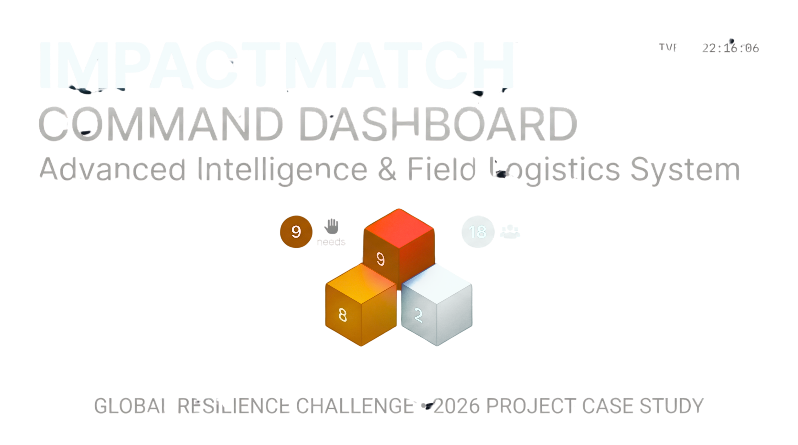
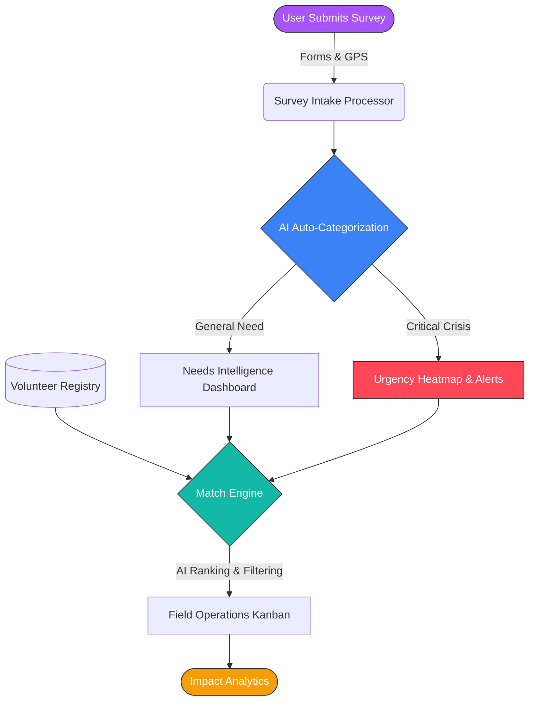
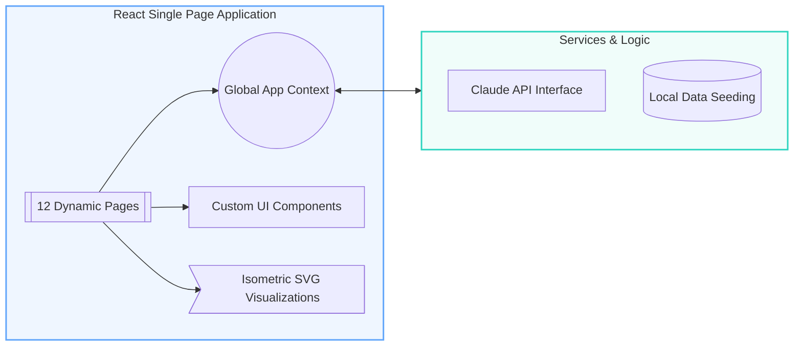

  

<h1 align="center">ImpactMatch — Volunteer Coordination OS</h1>

  
  
  
  
  
  
  

## Overview

A cutting-edge, 12-page React 18 Single Page Application designed for NGO volunteer coordination. Featuring AI-powered match engines, real-time isometric SVG visualization graphics, and a beautifully minimal, flat design system driven purely by robust CSS custom variables.

---

## 🌊 Flowchart

The data pipeline for community surveys reaching a field operative:

---

## ⚙️ System Diagram

The overall module relationship mapped visually:

---

## 🏛️ Architecture Design

| Component Level | Technology Choice | Responsibility / Description |
| :--- | :--- | :--- |
| **Core Framework** | `React 18` | Declarative View Layer, utilizing functional components and hooks structure. |
| **Build & Bundle** | `Vite` | Extremely fast module replacement (HMR), tree-shaking, and minification. |
| **Application Routing** | `React Router DOM` | Manages nested route layouts and guards across all 12 operational pages. |
| **State Management** | `React Context API` | Provides global access to `volunteers`, `needs`, `zones`, and `settings` globally. |
| **Design / Styling** | `Vanilla CSS 3` | A pure CSS token approach. Avoids tailwind for perfect custom scale increments and `var()` definitions. |
| **Data Enrichment** | `Anthropic API` | Fetches daily briefs, auto-categorizes need forms, and matches volunteers using logic prompts. |
| **Live Graphics** | `Custom SVG DOM` | High-performance interactive visualizations (bar prisms, logic lattices, district grids) rendering natively. |

---

## 📊 Live Sample Data

Snapshot of the mock telemetry populating the initial dashboard grid:

| Zone ID | District Name | Total Needs | Open Needs | Active Volunteers | Area Coverage | Urgency Alert |
| :------- | :------------ | :---------- | :--------- | :---------------- | :------------ | :------------ |
| **z1** | North District | 5 | 3 | 2 | `72%` | **CRITICAL** |
| **z2** | East Commerce | 2 | 1 | 4 | `94%` | **MODERATE** |
| **z3** | South Valley | 4 | 2 | 1 | `56%` | **HIGH** |
| **z4** | West Hills | 1 | 0 | 5 | `100%` | **LOW** |

> _Note: Calculations for coverage are based on volunteer allocation divided by the maximum historical incident baseline._
